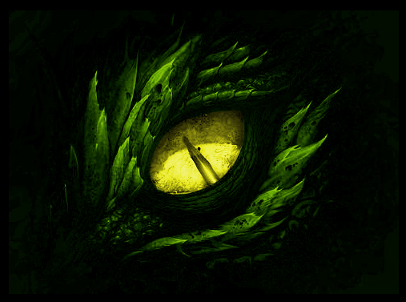

# KIRSATH - Wächter der Natur
Der grüne Drache KIRSATH taucht hin-und-wieder in den diversen Geschichten von BC auf. Mit seinem ruhigen und kindlichen Gemüt scheint er hilflos und verletzlich. Doch sind seine Taten oft ausschlaggebend für die Wendung der Erzählungen zum Guten.

## KIRSATHs Systematik und Merkmale
* Klasse: Drachen (Draconis)
* Ordnung: Echte Drachen (Dracodraconis)
* Unterordnung: Große Drachen (Majordraco)
* Familie: Element-Drachen (Elemendraconea)
* Unterfamilie:  Fliegende Drachen (Draconiscornea)
* Gattung: Erd-Drachen (Terraconis)
* Art: Wald-Drache (Silvraconis)
* Farbe: dunkel Grün
* Rolle: Wächterdrache
* Hauptwohnsitz: Python

## KIRSATHs Weisheit
> Wenn Du wirklich von Herzen an etwas glaubst, dann existiert es auch.

## Drachenauge by &copy; BC

Vielen Dank an BC zur Erlaubnis der Nutzung dieses Bildes für diese Internetseite  
(zum reinen privaten Gebrauch)  
(Bitte weder kopieren noch auf eine andere Weise verwenden.)
